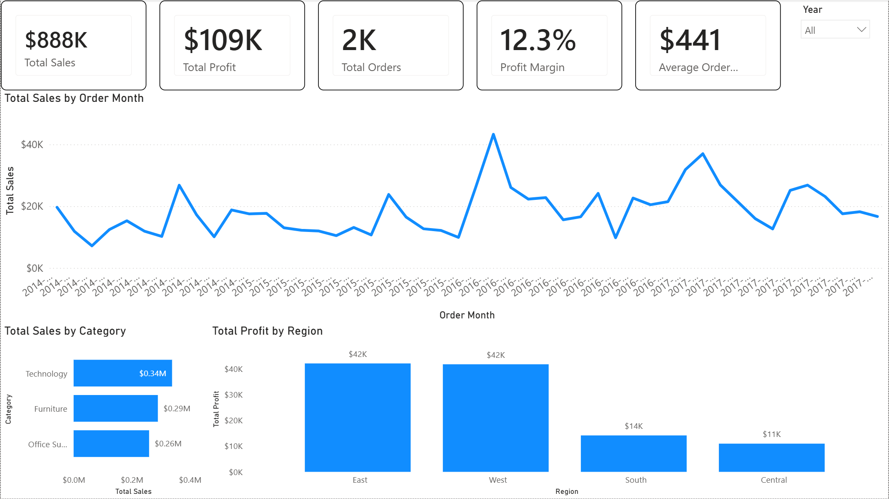

# 📊 Retail Sales Dashboard (Power BI)

## 📌 Project Overview
This Power BI dashboard analyzes retail sales performance using the Superstore dataset.  
It provides insights into revenue trends, profitability, and regional performance.

---

## 🎯 Key Metrics
- Total Sales
- Total Profit
- Total Orders
- Profit Margin
- Average Order Value

---

## 📈 Dashboard Features
- Monthly Sales Trend
- Sales by Category
- Profit by Region
- Interactive Year Slicer

---

## 📂 Project Structure

retail-sales-dashboard-powerbi
├── dashboard
│ └── Superstore_Sales_Dashboard.pbix
├── data
│ └── superstore.csv
├── images
│ └── dashboard-preview.png
└── README.md

---

## 🛠 Tools Used
- Power BI Desktop
- DAX Measures
- Data Modeling
- Data Visualization Best Practices

---

## 🚀 How to Use
1. Download the `.pbix` file from the dashboard folder
2. Open in Power BI Desktop
3. Use the Year slicer to explore different years

---

## 👤 Author
Bali Pratama Tok
